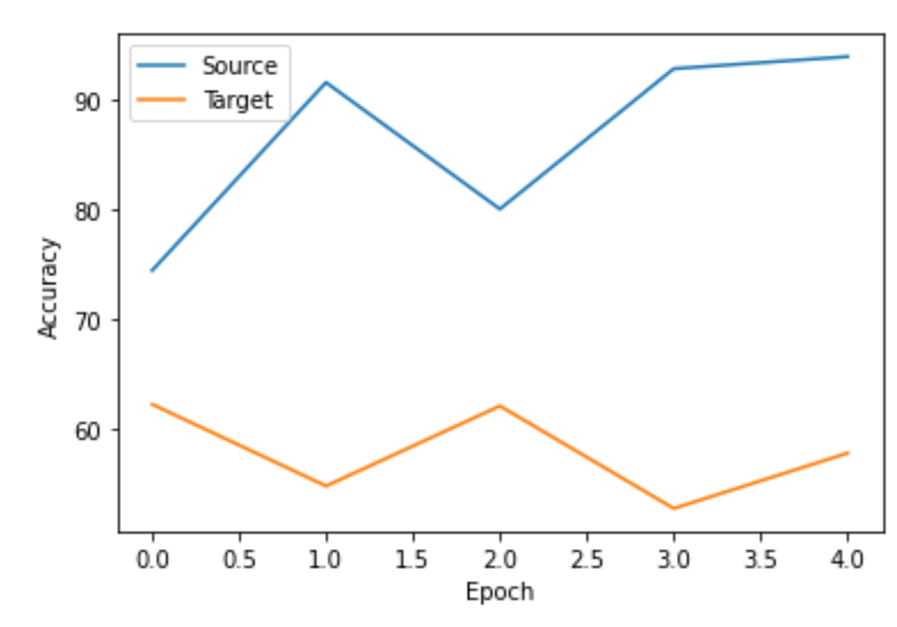

# Diagnosing COVID-19 Chest X-Rays Using Convolutional Neural Networks and Domain Adaptation

## Table of contents
1. [Authors](#authors)
2. [Description](#Description)
    1. [DANN Model Overview](#DANN-Model-Overview)
    2. [Contributions of Our Work](#Contributions-of-Our-Work)
    3. [Methodology](#Methodology)
    4. [Results](#Results)
    5. [Future Research](#Future-Research)
3. [Usage](#Usage)
4. [Works Cited](#Works-Cited)

## Authors
[Maya Ravichandran](https://github.com/maravichandran), [Arastou Pournadali Khamseh](https://github.com/arastoo723), [Ajay Koritala](https://github.com/joybot56), [Michael McGillicuddy](https://github.com/mpaul418)

## Description
### DANN Model Overview
Domain-Adversarial Training of Neural Networks (DANN), proposed by Ganin et al., is a popular domain adaptation method that is simple to implement and only requires slight additions to standard neural networks [1]. In this algorithm, the standard feed-forward neural network is split into two parts as illustrated in Fig. 1:  deep feature extractor (green) and a deep label predictor (blue). A domain classifier (red) is connected to the feature extractor via a gradient reversal layer. During the backpropagation process in the training, the gradient reversal layer multiplies the gradient by a certain negative constant to achieve unsupervised domain adaptation between the source and target domains. The key idea here is that the gradient reversal ensures that the feature distributions over the two domains are made similar. Therefore, the classifier cannot distinguish between source and target domain and it will mainly focus on the domain-invariant features.

Fig. 1: Schematic structure of DANN domain adaptation model

### Contributions of Our Work
In this work, we would like to assess the ability of the DANN algorithm to generalize a model that can classify X-ray images of different lung diseases as healthy or unhealthy. The base model will be trained on pneumonia disease X-ray images and the target domain is selected to be COVID-19 X-ray images. Our goal is to perform domain shift and identify common features between the source and target domain which helps increase the accuracy of the base model when dealing with the target domain. To our knowledge, no prior studies have been done on domain adaptation between pneumonia and COVID-19 chest X-ray images or on using DANNs for this application. 

### Methodology
We referenced a Kaggle notebook [2] for most of our baseline code with a few changes. We shifted from resnet18 to resnet152 and also went for a general healthy and unhealthy lung classification instead of distinguishing between COVID-19 lung images and Pneumonia images. In our implementation we trained and tested the resnet on the COVID-19 Radiography Database [3] and the Chest X-Ray Images dataset [4] from Kaggle. We trained the resnet model for a single epoch on X-ray images of healthy lungs and lungs with pneumonia, and then tested it on lungs with COVID-19 to see if the model would be able to recognize these lungs as unhealthy along with the pneumonia patients. 

Our domain adaptation model was designed based on Domain-Adversarial Training of Neural Networks (DANN), which was put forth in a paper by Yaroslav Ganin, Evgeniya Ustinova, et. al [1].  The main codebase that we used as reference for this implementation was CuthbertCai’s Pytorch DANN [5] model on Github.  Most of the changes we made to the code were preprocessing adjustments and getting our data to work when input into the model (resizing images, splitting into training and test, giving the model the training data, etc.).  The actual implementation of the DANN model is unchanged, except for a slight change in the SVHN extractor and classifier; we had to adjust what the data was being resized to, as our data had a different shape compared to what the model was previously receiving.
Essentially, our DANN model works by combining data from the COVID-19 Radiography Database [3] and Chest X-Ray Images dataset [4], so that we have around 10,000 healthy patient X-rays, 5,000 patients with pneumonia, and 3,000 patients with COVID-19.  Our source domain is healthy patients and patients with pneumonia, and our target domain is healthy patients and patients with COVID-19.  Thus, we input these source and target designations into the DANN model, and then train it over several epochs.  After each epoch, the accuracy on the source and target domains are recorded, and then once the training finished, a graph is printed with the accuracies at each epoch.

### Results
The accuracy of our models fluctuated each time we ran the models. We found that that accuracy of our baseline model was approximately 50-55%, with an exact value of 49.50% accuracy in classifying the test data as healthy or unhealthy (COVID) on our most recent run. This is approximately the same as the accuracy of randomly assigning the test data to healthy or unhealthy. Our DANN model outperformed the baseline model, with an accuracy of approximately 60-65%, with an exact value of 62.25% on our most recent run. Hence, the DANN model was successful in improving the accuracy of domain adaptation compared to the baseline. 

<figcaption>Fig. 2: Progression of accuracy (as a percentage) on testing data over time as the DANN model was trained over multiple epochs.</figcaption>

As shown in Fig. 2, the accuracy of the model fluctuated as it was trained over multiple epochs. We reported our accuracy of 62.25% by taking the maximum accuracy achieved over all the epochs.

One thing to acknowledge when comparing the accuracy of our baseline model to our DANN model is that in order to make our model work with the data, we downsized the images during the pre-processing stage to reduce the amount of computing resources required during training, which we did not have to do with the baseline model that utilized resnet152. With more computing resources, we may be able to achieve better results with only slight modifications to our DANN model since we would be able to use the full-sized images with our DANN model. 

### Future Research
There are several factors that we believe would contribute to greater performance from our domain adaptation model.  An increase in computing power would have helped us greatly, as it would have allowed us to use higher resolution versions of the images (we had to resize our images to 170x170 in order to have sufficient RAM to run the model), and also train the model for more epochs; even running the model for five epochs would take around 45 minutes.  Also, our model likely would have been better with more data, as we only had around 18,000 total images, which were split across three categories. In addition, we could incorporate further data points related to each patient, such as their age, gender, and previous health conditions, as these factors are related to the severity and progression of COVID-19. If these changes were made, we believe this model could have shown an even greater increase in accuracy compared to our base model.

## Usage
The two files are `COVID base DA model.ipynb`, which contains our baseline domain adaptation model using ResNet, and `CS550 DANN Model.ipynb`, which has our DANN model. Our two models are Jupyter notebooks, so no external downloads/etc. are needed to run them, just an installation of Python.  We ran our notebooks in [Google Colaboratory](https://colab.research.google.com/) so we would have a built-in environment, file space, etc.  The instructions to run both models are identical: simply run all cells.  In the second cell of each file, you will need to upload a kaggle.json file, which can be obtained from going to your Kaggle account page, going to the Account tab, and clicking the "Create new API token" button and saving the file (this is needed in order to download the datasets).  Then, the datasets will download and the model will run, and nothing else is required from the user.  The base neural network model takes around 15 minutes to run, and the DANN model takes around 90 minutes to run.  

Note that there are two cases where more actions are required.  First, if the program is run multiple times in the same session, the cells that unzip the data (there is one at cell 5 in the base model, and two at cells 5 and 7 in the DANN model) will prompt the user for input; you can input either A or N, it does not matter. Second, if the DANN model gets an error saying that it ran out of RAM, simply select the "Restart and run all" option for the notebook, as this will free up enough RAM for it to run.

## Works Cited
1. Ganin, Y., Ustinova, E., Ajakan, H., Germain, P., Larochelle, H., Laviolette, F., Marchand, M. and Lempitsky. Domain-adversarial training of neural networks. JMLR 17, 1 (Jan. 2016), 2096-2030. 
2. Dsouza, A.,  Covid-19 chest x-ray classification with resnet 18. https://www.kaggle.com/arunlukedsouza/covid-19-chest-x-ray-classification-with-resnet-18, (2021)
3. COVID-19 radiography dataset. https://www.kaggle.com/tawsifurrahman/covid19-radiography-database?select=COVID-19_Radiography_Dataset, (2021)
4. Chest X-ray pneumonia. https://www.kaggle.com/paultimothymooney/chest-xray-pneumonia(2021)
5. CuthbertCai, pytorch_DANN. https://github.com/CuthbertCai/pytorch_DANN (2021)
6. Zhang, J., Xie, Y., Li, Y., Shen, C. and Xia, Y. Covid-19 screening on chest x-ray images using deep learning based anomaly detection. arXiv preprint arXiv:2003.12338, 27 (2020).
7. Gu, Y., Ge, Z., Bonnington, C. P. and Zhou, J. Progressive transfer learning and adversarial domain adaptation for cross-domain skin disease classification. IEEE journal of biomedical and health informatics, 24, 5 (2019), 1379-1393.
